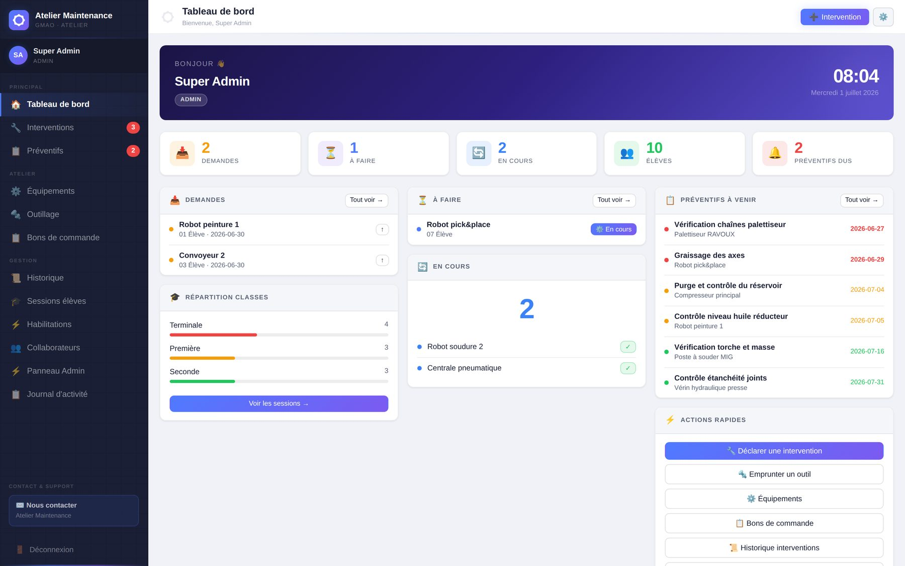
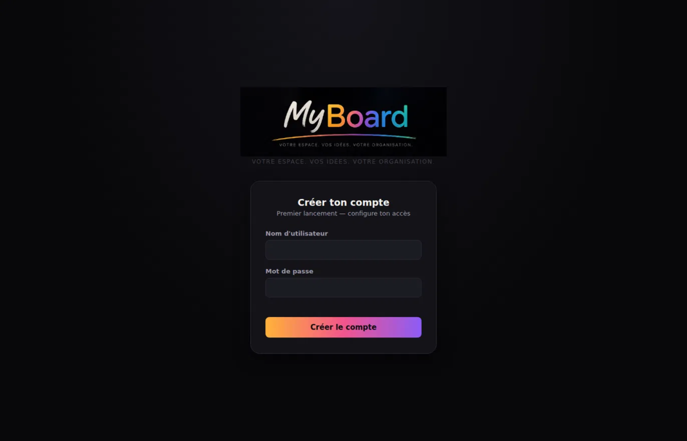
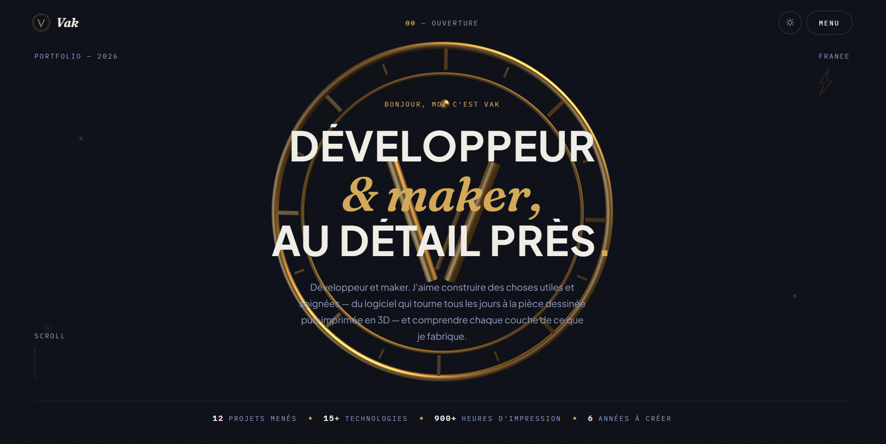
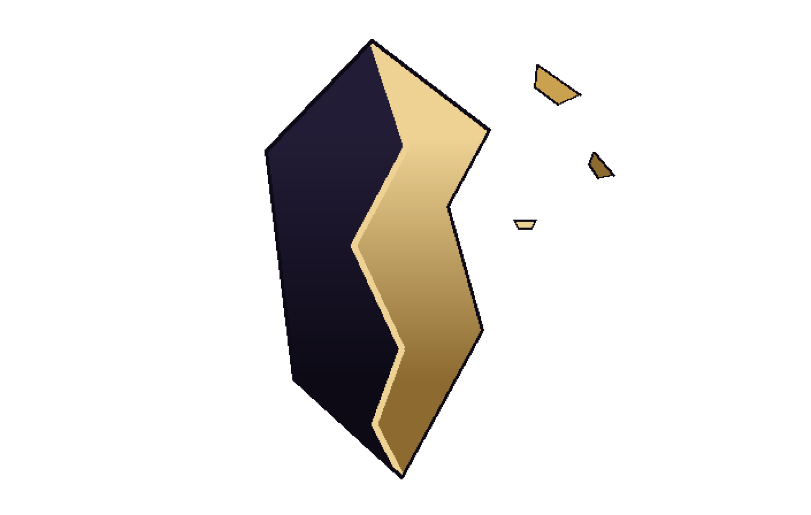

  # Hellow ! :3

  

  
  
  

  
  <h3>🚀 à propos</h3>

  Je suis un homme, un homme simple, je suis *Vakou* !
  
  Je commence actuellement un cursus technique axé sur les systèmes connectés & industriels — mais, pour être honnête, la majeure partie de mes réalisations voit le jour en dehors des cours :)
  
  J'aime choisir un problème, acquérir les connaissances nécessaires pour le résoudre et concrétiser un projet fonctionnel.  
  Ces derniers temps, cela s'est traduit par le développement d'applications web auto-hébergées, la création d'un serveur mini-jeux entièrement personnalisé au sein de *Minecraft*, ainsi que par des expérimentations pratiques autour du matériel *(hardware)* et de l'impression 3D.
  
  **Oh, aussi !** 
  $${\color{#D4A857}\text{\textit{-- Bien fait vaut mieux que vite fait — et le mieux, c'est quand c'est les deux ! --}}}$$

 <h3>🛠️ Langages & logiciels :</h3> 

 

  
  
  
  
  

   

  
  
  
  

   

  
 
    
  *Rangé par catégorie pour une meilleure visibilité des compétences :)* 
  
  

 <h3>📌 Projet</h3> 

Application de Gestion de maintenance Assistée par Ordinateur basée sur le Web ; Créée dans le cadre de mes études en *Terminale Baccalauréat Professionnel*

 

Un bloc-note amélioré ; un tableau blanc INFINI, où l'ajout de médias, liens et dessins vient compléter le texte, dans un univers infini où plusieurs boards peuvent exister en symbiose.

 

[-0b0d16?style=for-the-badge&labelColor=D4A857)](https://portfolio-qjo4.onrender.com/#hero)  

Site personnel aux tons sombres et dorés, doté de modèle 3D en *Three.js* et d'animations déclenchées par le défilement de la souris, soupoudré d'une multitude de références cachées, *d'easter egg*, aux quatre coins du site :)

 

Un univers narratif entièrement personnalisé, des mécaniques innovantes, un système de dialogue avec les PNJ complet, sans compter l'architecture immersive.

 

 <h3>📊 Stats</h3> 

  
  

  

  <picture>
    <source media="(prefers-color-scheme: dark)" srcset="https://raw.githubusercontent.com/MrVacasse/MrVacasse/output/github-contribution-grid-snake-dark.svg" />
    <source media="(prefers-color-scheme: light)" srcset="https://raw.githubusercontent.com/MrVacasse/MrVacasse/output/github-contribution-grid-snake.svg" />
    
  </picture>

  <h3>🌐 Me retrouver</h3>

   

  
  

   
   
  
Conçu avec 🧡 par *Vakou* !

<!--
  Si tu lis ceci...

  Félicitations.
  Tu viens de trouver le premier easter egg.
  
  Maintenant va voir mon portfolio. 👀
-->
